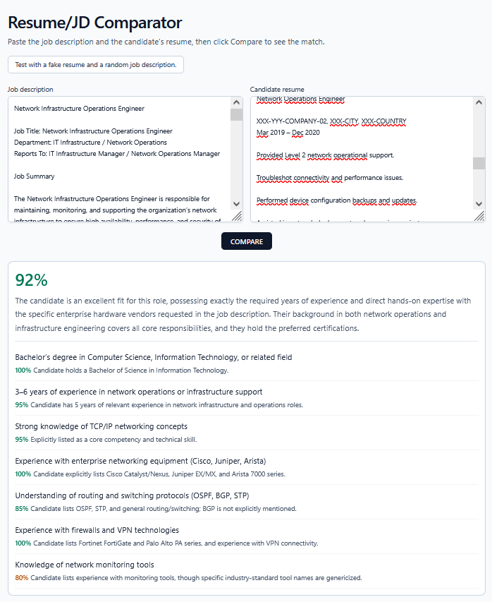

*This is a personal GitHub project built to showcase this work in my portfolio.

# Introduction

Resume/JD Comparator helps recruiters and hiring teams quickly evaluate resume-to-role fit.
You paste a **job description** and a **candidate resume**, and the app returns a structured assessment with:

- overall fit score
- key matching strengths
- concise reasoning grounded in the provided documents



The goal is to provide a fast first-pass screening aid, or to quickly check whether a resume matches your target job.

# Structure

- **Frontend**: Vue 3 + Vite + Tailwind app in `front/`.
- **Backend**: Python (Flask) pipeline that sends job description + resume text directly to one LLM scoring call and returns strict JSON.
- **LLM runtime**: local Ollama (`llm` Docker service) or Gemini via Vertex AI.

## Run locally with Docker

Use Docker Compose to run everything (frontend + backend + local LLM).

1. Copy the env template, and fill the values:

   ```bash
   cp .env.example .env
   ```

2. Start containers:

   ```bash
   docker compose up -d --build
   ```

3. Open the app:
   - Frontend: [http://localhost:9919](http://localhost:9919)
   - Backend API: `http://localhost:5000`

## Use Gemini with Google Cloud (Vertex AI)

1. In Google Cloud, enable `Vertex AI API`, create a service account with **Vertex AI User** role, and create a JSON key for it.
2. Download the key, and then, in `.env`, set `GOOGLE_CREDENTIALS_FILE` to the **path of that file on your machine**, and add the other Vertex settings:

   ```bash
   LLM_PROVIDER=gemini-vertex
   LLM_MODEL=gemini-2.5-flash-lite
   GOOGLE_CLOUD_PROJECT=your-project-id
   GOOGLE_CLOUD_LOCATION=global
   GOOGLE_CREDENTIALS_FILE=$HOME/.config/google/vertex-credentials.json
   ```

   The file is mounted into the container at `/opt/vertex-credentials.json` and used for authentication.

3. Start containers:

   ```bash
   docker compose up -d --build
   ```

## LangSmith observability

- Traces for LangChain model calls are sent to LangSmith when tracing is enabled.

## CI/CD

**Frontend** Cloudflare Pages : builds and deploy on push to `main`
**Backend**  AWS EC2 : GitHub Actions builds the Docker image, pushes to AWS ECR, then SSHs into EC2 to pull and restart the container

## Settings

- Typed runtime config is centralized in `backend/infrastructure/config/settings.py`.

## Usage

- Focus only on skills, experience, and qualifications.
- Pasted job description and resume are sent as-is to the AI provider. (see later updates below)
- Constrain outputs to strict JSON objects.

## Later updates

- Add a backend preprocessing step to detect and redact personal/sensitive information (PII) before sending text to the AI model.
